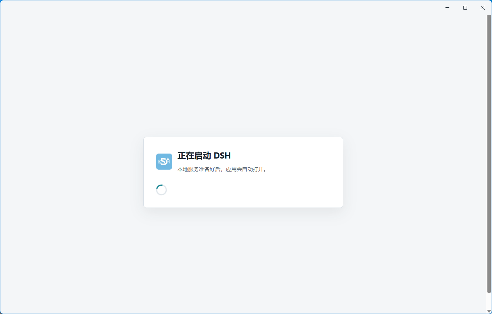
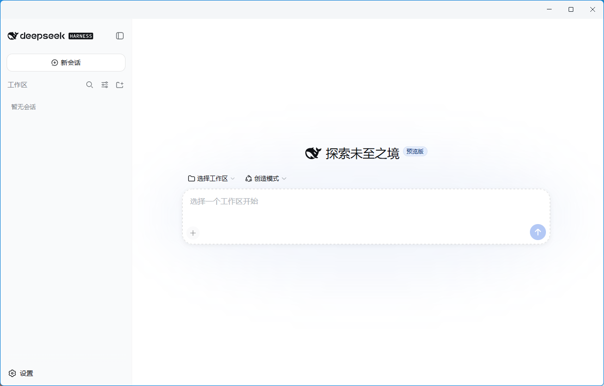
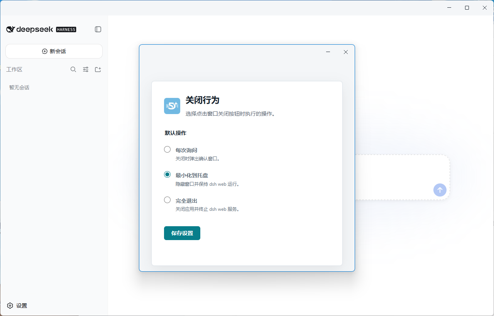

# DSH Desktop

DSH Desktop 是一个面向 Windows 的简单 Electron 封装程序。它负责在后台启动 `dsh web`，等待本地服务就绪，然后在桌面窗口中加载 `http://127.0.0.1:3080`，让 DSH Web 以接近原生桌面应用的方式运行。

本项目只提供桌面封装和进程管理，不包含 DSH 服务本身，也不修改 DSH 的功能。代码结构相对简单，其他使用者可以根据自己的需求继续完善界面、配置、更新机制或其他功能。

## 软件截图

### 启动界面



### 主界面



### 设置界面



## 使用前准备

必须按照下面的顺序完成环境安装。未安装 Node.js 或 DSH 时，本程序无法正常启动服务。

### 1. 安装 Node.js

需要安装 **Node.js v23.11.1 或更高版本**。

本项目已在 Node.js `v23.11.1` 环境下完成开发和验证。安装 Node.js 后，请打开一个新的 CMD 或 PowerShell 窗口检查版本：

```powershell
node --version
npm --version
```

`node --version` 的结果应为 `v23.11.1` 或更高版本。

### 2. 全局安装 DSH

使用 npm 全局安装 DSH 服务：

```powershell
npm install -g @deepseek-ai/dsh
```

安装完成后，打开一个新的 CMD 或 PowerShell 窗口进行验证：

```powershell
dsh --version
```

还可以手动启动一次 Web 服务，确认环境和 PATH 配置正确：

```powershell
dsh web
```

看到本地服务成功启动后，可以按 `Ctrl+C` 停止测试服务。

### 3. 安装 DSH Desktop

完成 Node.js 和 DSH 安装后，再运行：

```text
DSH-Desktop-Setup-1.0.0-x64.exe
```

安装程序支持选择安装目录，并会创建桌面快捷方式和开始菜单快捷方式。

## 当前功能

- 启动应用时自动执行 `dsh web`。
- 等待 `http://127.0.0.1:3080` 服务就绪后再加载页面。
- 启动或重新启动服务前检查 TCP 端口 `3080`。
- 自动结束占用 `3080` 端口的进程树，再启动新的 DSH 服务。
- 无法释放端口时停止启动，并显示占用 PID 和错误原因。
- 服务启动失败时显示错误页面，并提供重新启动服务按钮。
- 将 DSH Web 页面显示在独立的 Windows 桌面窗口中。
- 隐藏 Electron 默认菜单栏。
- 使用自定义标题栏颜色，同时保留拖动、最小化、最大化和关闭功能。
- 支持最小化到 Windows 系统托盘，后台服务继续运行。
- 托盘菜单提供显示窗口、重新启动服务、设置和退出功能。
- 点击关闭按钮时可以选择最小化到托盘或完全退出。
- 支持记住关闭选择，也可以在设置窗口中重新修改。
- 完全退出时终止本程序启动的 `dsh web` 进程树。
- 使用单实例锁，重复启动时激活已有窗口，不重复启动服务。
- 使用项目自定义图标生成窗口、主程序、托盘和安装包图标。
- 提供 Windows x64 NSIS 安装包和免安装解包版本。

## 使用说明

启动 DSH Desktop 后，程序会先检查并清理 `3080` 端口，然后在后台运行 `dsh web`。服务准备完成后，主窗口会自动显示 DSH 页面。

关闭主窗口时，默认会弹出确认框：

- **最小化到托盘**：隐藏窗口，`dsh web` 继续运行。
- **完全退出**：结束 DSH 服务进程树并退出桌面程序。
- **记住我的选择**：后续直接执行选定操作，不再重复询问。

可以通过托盘菜单中的“设置”恢复“每次询问”，或者改为固定最小化到托盘、固定完全退出。

## 常见问题

### 提示找不到 `dsh` 命令

请确认已经执行：

```powershell
npm install -g @deepseek-ai/dsh
```

安装后需要重新打开 CMD、PowerShell 或 DSH Desktop，使新的 PATH 环境变量生效。

### 端口 3080 无法释放

应用会尝试结束占用端口的完整进程树。如果占用进程权限高于当前用户，Windows 可能拒绝终止操作。请根据错误页面显示的 PID 手动检查进程，或使用管理员权限处理该进程后重试。

### 覆盖安装后仍然显示旧版本

安装新版前，请先从系统托盘菜单选择“退出”，确保旧版本程序和后台服务已经完全关闭，然后再运行新的安装包。

### 桌面快捷方式仍显示旧图标

Windows 可能缓存快捷方式图标。可以删除旧快捷方式并重新安装程序，必要时重新启动 Windows 资源管理器。

## 开发与构建

克隆或取得源码后，在项目目录执行：

```powershell
npm install
npm test
npm run check
npm start
```

生成 Windows x64 安装包：

```powershell
npm run dist
```

构建产物：

- 安装包：`dist/DSH-Desktop-Setup-1.0.0-x64.exe`
- 免安装程序：`dist/win-unpacked/DSH Desktop.exe`

## 项目结构

```text
src/
  main.js               Electron 主进程、窗口、托盘和应用生命周期
  preload.js            受限的渲染进程 IPC 接口
  service-manager.js    dsh web 服务启动、检测、重启和停止
  port-cleanup.js       Windows 3080 端口查询与进程清理
  settings.js           关闭行为设置的读取和保存
  window-style.js       标题栏颜色、拖拽区域和设置窗口尺寸
  pages/                 启动、错误和设置页面
scripts/
  create-icon.js        将 icon.png 转换为 Windows ICO
  after-pack.js         将图标写入打包后的 Windows 主程序
test/                    Node.js 自动化测试
```

## 二次开发说明

这是一个简单的 Electron 封包项目，主要目标是让已经安装好的 `dsh web` 以 Windows 桌面应用形式运行。它不是 DSH 官方客户端，也不包含 DSH 的核心代码。

其他开发者可以在此基础上自行完善，例如：

- 增加开机启动设置。
- 增加应用内日志查看和导出。
- 增加 DSH 路径、端口和启动参数配置。
- 增加自动更新功能。
- 优化多显示器和不同 DPI 下的窗口体验。
- 增加更完整的服务状态与异常恢复能力。

扩展功能时，请继续保持主进程、服务管理、设置和页面之间的职责边界，并为进程生命周期和端口操作补充相应测试。

## 开源许可证

本项目采用 [MIT License](./LICENSE) 开源。
